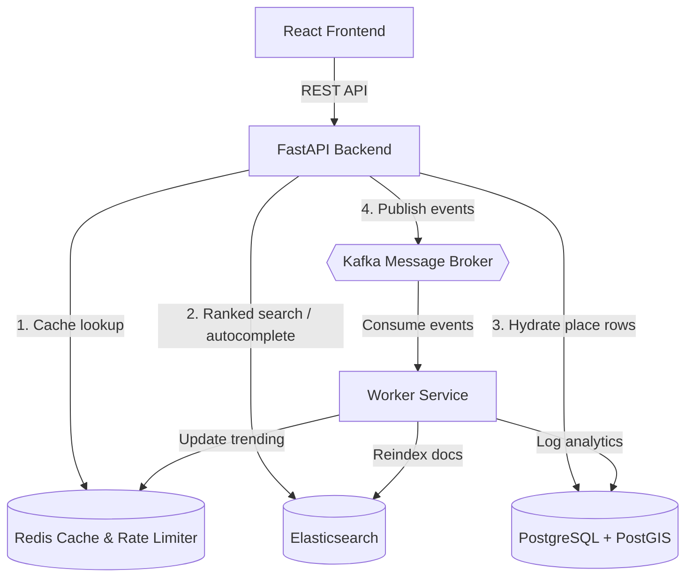
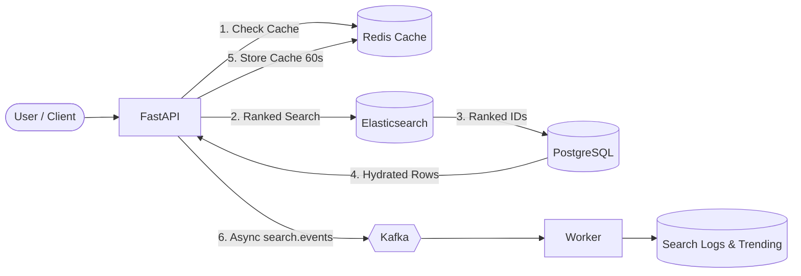
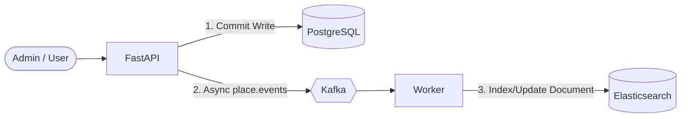

# GeoSearch

Map-based place search over **PostgreSQL + PostGIS**, **Elasticsearch**, **FastAPI**, **React**, **Redis** and **Kafka**.

Search ~400 seeded places across six cities by text, category, amenity or proximity — with typo tolerance, synonyms, autocomplete, faceting and a clustered map.

     

---

## Quick start

```bash
docker compose up -d --build
```

Wait for the health checks to pass (Elasticsearch takes the longest, ~40s), then load the sample data:

```bash
docker compose exec api python -m seed.seed
```

| Service       | URL                            |
| ------------- | ------------------------------ |
| Web app       | http://localhost:5178          |
| API docs      | http://localhost:8300/docs     |
| Health        | http://localhost:8300/health   |
| Elasticsearch | http://localhost:9202          |
| Postgres      | `localhost:5434` (geo/geo)     |
| Redis         | `localhost:6381`               |
| Kafka         | `localhost:29094`              |

Seeded accounts: `demo@geosearch.dev` / `demo1234` — `admin@geosearch.dev` / `admin1234`.

Ports are deliberately non-default so this stack can run alongside other local projects.

---

## What each piece actually does

This is the part worth understanding — every service earns its place.

**PostgreSQL** is the source of truth. Every write lands here first, and search results are always hydrated from here, so the UI can never render a stale copy of a place.

**PostGIS** owns spatial queries. Places carry a `geography(POINT, 4326)` column behind a GiST index, so `/places/nearby` does a true nearest-neighbour scan (`ST_DWithin` to prune, `<->` to order) rather than computing distance to every row.

**Elasticsearch** owns retrieval and ranking: which places match, in what order. It holds a denormalised copy of each place tuned for search — synonyms and stemming at query time, edge n-grams for autocomplete, `geo_point` for radius and viewport filters. It returns ids; Postgres fills in the rest.

**Redis** does two jobs: a 60-second cache on search and autocomplete responses (measured: 95 ms → 3 ms on a repeat query), and a fixed-window rate limiter on every endpoint. Trending searches also live here as a sorted set.

**Kafka** decouples writes from everything downstream. Creating a place commits to Postgres and publishes `place.events`; a separate worker consumes it and updates the Elasticsearch document. Searches publish `search.events`, which the same worker turns into search logs and trending counters. A slow Elasticsearch or a burst of analytics can never make a user's write time out.

### Architecture overview



### Search flow



### Write flow



> For full architectural details, sequence diagrams, and ER diagrams, see [architecture.md](docs/architecture.md).

---

## Features

**Search** — full-text with BM25 ranking, typo tolerance (`cofee` → cafes), synonyms (`pub` → bars), stemming, phrase and exact-name boosting, highlighting, autocomplete via edge n-grams, trending searches, per-user search history.

**Geo** — radius search, map viewport (bounding box) search, distance on every result, distance sorting, PostGIS nearest-neighbour, "search this area", "near me".

**Filters & sorting** — category, city, minimum rating, max price, open-now, eight amenity flags, all with live facet counts; seven sort orders.

**Places** — detail view, reviews with ratings and helpful votes, favourites, and "similar places" via Elasticsearch `more_like_this`.

**Ops** — JWT auth with roles, rate limiting, health checks, search analytics for admins (top queries, zero-result queries, average latency).

### Interface

The list and the map are two views of one selection, so they stay in step: hovering a result highlights its pin and vice versa, selecting either flies the map there and scrolls the card into view. Everything else follows from that — category colour is shared between pin, badge and detail header; active filters appear as removable pills above the results; skeletons mirror the real layout so nothing shifts when data lands; `/` focuses search, arrows walk the suggestions, `Esc` backs out a level.

The map only offers to re-search an area once you have actually moved it, and it frames the top result's city rather than fitting every hit — one match in San Francisco alongside twenty in Tokyo would otherwise force an unreadable whole-world view. The ⤢ control fits everything when you do want the global picture.

Below `md` the panes become a List/Map switch and the filter sidebar becomes a drawer.

### Ranking, briefly

Text matching is layered loosest to strictest: any term matches (recall), then *every* term matches somewhere fuzzily (`boost: 4`), then exact phrase (`6`), then exact name (`10`). On top sits a deliberately gentle quality boost from rating and popularity, capped at `2.0` — enough to break ties, not enough to let a popular hotel outrank a matching cafe. See [`app/search/queries.py`](backend/app/search/queries.py).

---

## Layout

```
backend/
  app/
    config.py            settings + Kafka topic names
    db.py                engine, session, schema bootstrap
    cache.py             Redis cache, rate limiter, trending
    events.py            Kafka producer
    security.py          JWT, password hashing, role dependencies
    worker.py            Kafka consumer: ES sync + analytics
    models/              base · user · place · review · analytics
    schemas/             auth · place · search · review
    search/              mapping · client · documents · filters · queries · suggest
    routers/             auth · places · search · reviews · favorites · analytics
  seed/seed.py           deterministic sample-data generator
  tests/                 query-builder unit tests + live API tests
frontend/src/
  lib/                   api client · types · format · categories · toast · useGeoSearch hook
  components/            Header · SearchBar · FilterPanel · ActiveFilters · ResultList ·
                         PlaceDetail · MapView · Stars · Skeletons · Toaster · AuthDialog
```

Backend modules use absolute imports rooted at `app.`, so a module can move between subpackages without rewriting its imports.

---

## Tests

```bash
docker compose exec api pytest
```

23 tests: query-builder assertions that catch ranking regressions as a diff, plus live API tests covering typo tolerance, radius correctness, PostGIS/Elasticsearch agreement, review aggregation, favourites and authorisation.

---

## API

Full OpenAPI at http://localhost:8300/docs.

| Method | Path                            | Notes                                    |
| ------ | ------------------------------- | ---------------------------------------- |
| GET    | `/search`                       | text + geo + filters + facets            |
| GET    | `/autocomplete`                 | edge n-grams, ES only                    |
| GET    | `/trending`                     | from the Redis sorted set                |
| GET    | `/places/nearby`                | PostGIS nearest-neighbour                |
| GET    | `/places/{id}`                  |                                          |
| GET    | `/places/{id}/similar`          | `more_like_this`                         |
| POST   | `/places`                       | admin                                    |
| PUT    | `/places/{id}`                  | admin                                    |
| DELETE | `/places/{id}`                  | admin                                    |
| GET    | `/places/{id}/reviews`          |                                          |
| POST   | `/places/{id}/reviews`          | auth; recalculates the place rating      |
| GET    | `/favorites`                    | auth                                     |
| PUT    | `/favorites/{id}`               | auth                                     |
| DELETE | `/favorites/{id}`               | auth                                     |
| GET    | `/me/history`                   | auth                                     |
| GET    | `/admin/analytics`              | admin                                    |
| POST   | `/auth/register`, `/auth/login` |                                          |
| GET    | `/auth/me`                      | auth                                     |
| GET    | `/health`                       |                                          |

---

## Scope

Cut from the original PRD to keep the project buildable and the code readable: Kubernetes, GraphQL, Celery, CI/CD, a monitoring stack, the admin dashboard UI, notifications, collections, heat maps, routing, polygon/regex/wildcard search, multi-language search, and vector embeddings.

Embeddings are the notable omission. A locally faked embedding would demonstrate nothing, and a hosted one would add a paid dependency to a portfolio project — so "similar places" uses Elasticsearch `more_like_this`, which is real relevance over the text that is already indexed.

Also intentional: the schema is created with `create_all` rather than Alembic migrations, and CORS is wide open. Both are development conveniences, marked as such in the code.
