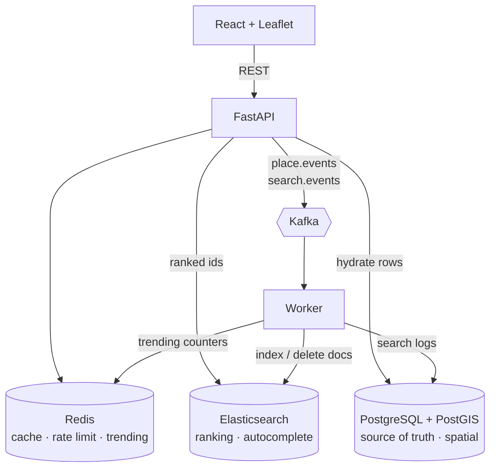
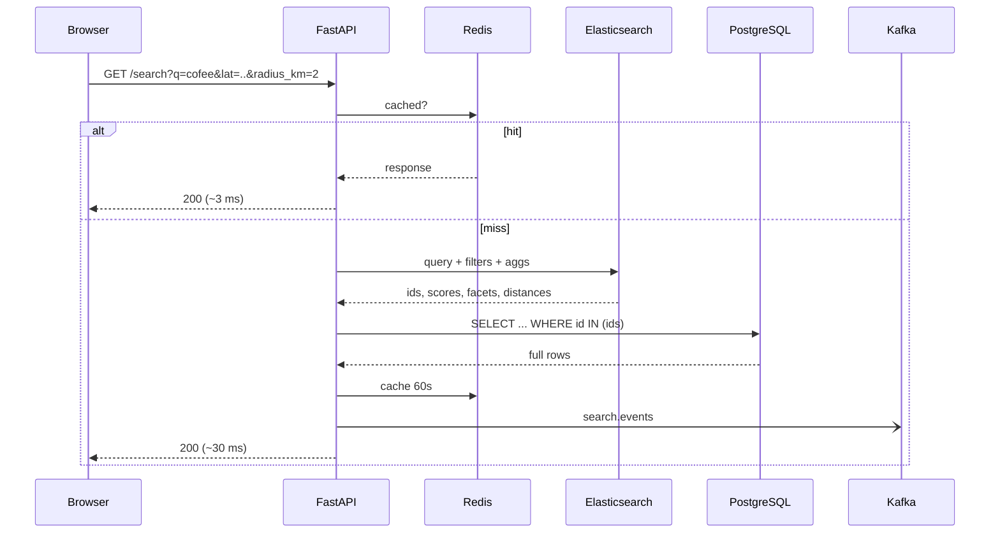
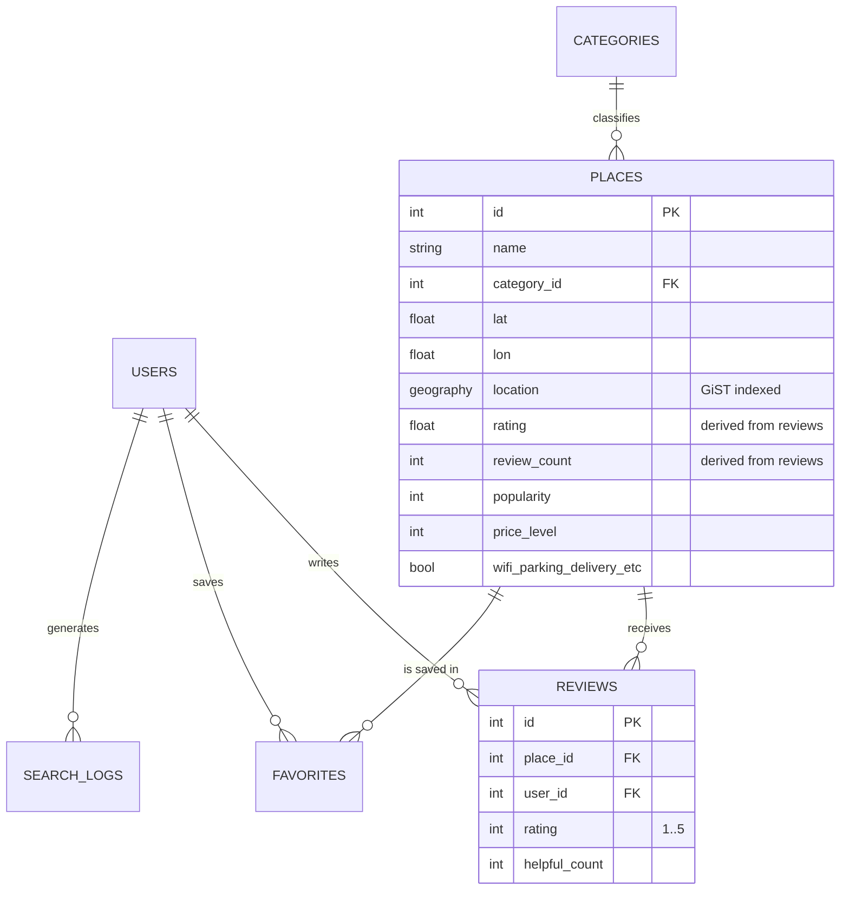

# Architecture

## Why two datastores

A place has to be found two different ways, and no single engine is good at both.

**"What matches these words?"** is a ranking problem: tokenisation, stemming, synonyms, edit distance, BM25 scoring. Postgres full-text search can do a version of this, but not typo tolerance across fields with per-field boosts and highlighting.

**"What is the truth about place #460?"** is a consistency problem: a rating that reflects every review, a row that cannot be half-updated.

So Postgres owns the truth and Elasticsearch owns retrieval. Elasticsearch answers *which* places match and in what order; Postgres answers *what those places are*. A search returns ids from Elasticsearch and hydrates them in one batched Postgres query — so a stale index can rank imperfectly, but it can never show a wrong price or a deleted place.

PostGIS is the exception that proves the rule: it is genuinely better than Elasticsearch at exact nearest-neighbour work, so `/places/nearby` uses it directly.

## Why Kafka

Without it, creating a place means: write Postgres, then write Elasticsearch, then log analytics — all inside the user's request. Elasticsearch being slow makes writes slow, and a failed index write leaves the two stores silently inconsistent with no record of what was missed.

With Kafka, the request commits to Postgres and publishes an event. The worker owns everything downstream. If it crashes, events wait in the topic; when it restarts it resumes from its committed offset and the index catches up. The user's write never blocked on any of it.

Two topics:

| Topic           | Published by         | Consumer does                                      |
| --------------- | -------------------- | -------------------------------------------------- |
| `place.events`  | place & review writes | reindex or delete the Elasticsearch document       |
| `search.events` | every non-empty search | insert a `search_logs` row, bump the Redis trending set |

Publishing is fire-and-forget: a dropped analytics event must never fail a user's request, so producer errors are logged rather than raised.

## Search request

## Data model

`rating` and `review_count` are denormalised onto `places` and recalculated whenever a review is written. They have to be: they are read by the rating filter, the rating sort and the relevance boost, and joining reviews on every search would defeat the point of the index. The recalculation happens in the same transaction as the review, so they cannot drift.

`lat`/`lon` and `location` are likewise two views of one fact — the floats serialise cheaply into responses and Elasticsearch documents, the geography column carries the GiST index that every spatial query uses. `Place.set_point()` is the only way to set either.

## Ranking

Text matching is layered, loosest first:

1. **Any term matches** — the recall net; decides what is eligible at all.
2. **Every term matches somewhere, fuzzily** (`boost: 4`) — decides what wins. Without it, "coffee tokyo" treats every place in Tokyo as an equally good answer, because one of two terms is enough to qualify. Implemented as one fuzzy `multi_match` per term rather than `cross_fields`, because `cross_fields` and `combined_fields` both ignore fuzziness — which would exclude the typo'd term this clause exists to tolerate.
3. **Exact phrase in the name** (`boost: 6`).
4. **Exact name** (`boost: 10`).

Then a quality boost from rating and popularity, `score_mode: sum`, `boost_mode: multiply`, capped at `max_boost: 2.0`. The cap is the important part: quality breaks ties between comparable matches, it does not let a popular hotel outrank a cafe that actually matched.

Filters (category, city, amenities, radius, viewport) sit in the `filter` context, so Elasticsearch skips scoring them and reuses cached bitsets — which is why a heavily filtered search is no slower than an open one.

Synonyms are applied only by the **query** analyzer, never at index time. Indexing synonyms bakes today's list into the documents; keeping it at query time means editing `SYNONYMS` and reloading takes effect immediately, with no reindex.

## Caching and limits

Search and autocomplete responses are cached in Redis for 60 seconds under a SHA-1 of the full parameter set — measured 95 ms → 3 ms on a repeat query. Any write to a place or review drops the `search:*` keys, so a rating change is visible immediately rather than up to a minute later.

Rate limiting is a fixed window per IP per path: one `INCR`, an `EXPIRE` on first hit, 429 past the threshold. Fixed windows allow a burst at a window boundary; a sliding window or token bucket would be the upgrade if this were public.

## Known limits

- Schema is created with `create_all`, not Alembic. Fine for a project that reseeds; a real deployment needs migrations.
- The worker's Elasticsearch write is at-least-once with auto-commit, so a crash between indexing and commit reprocesses the event. Indexing is idempotent (same document id), so this is safe.
- CORS allows every origin, and the JWT secret has a development default.
- Single-node Elasticsearch with one shard and no replicas.
